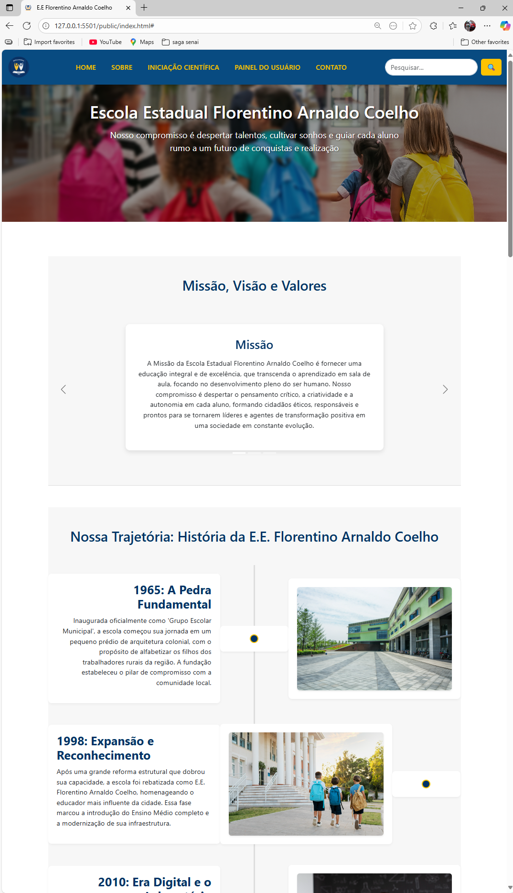
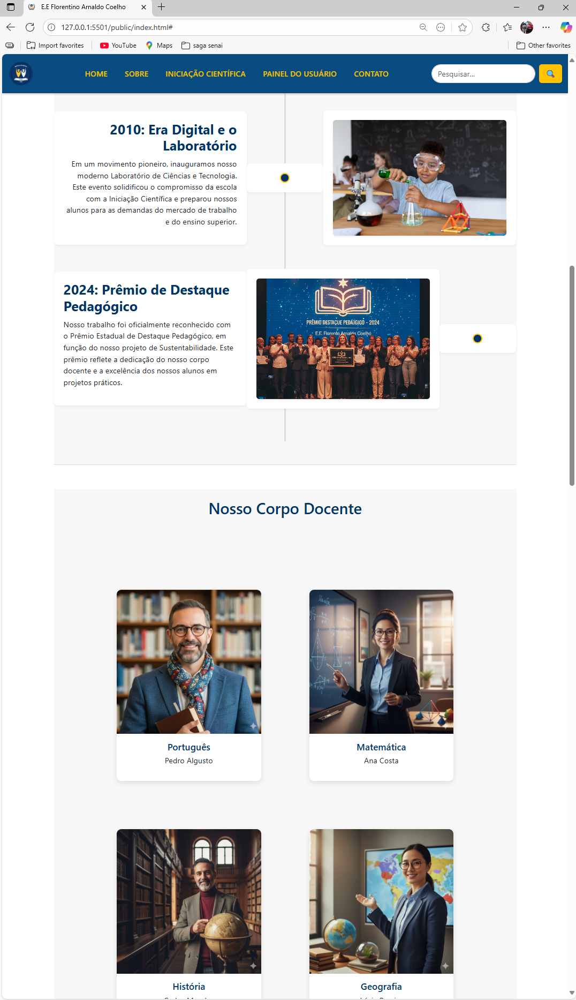
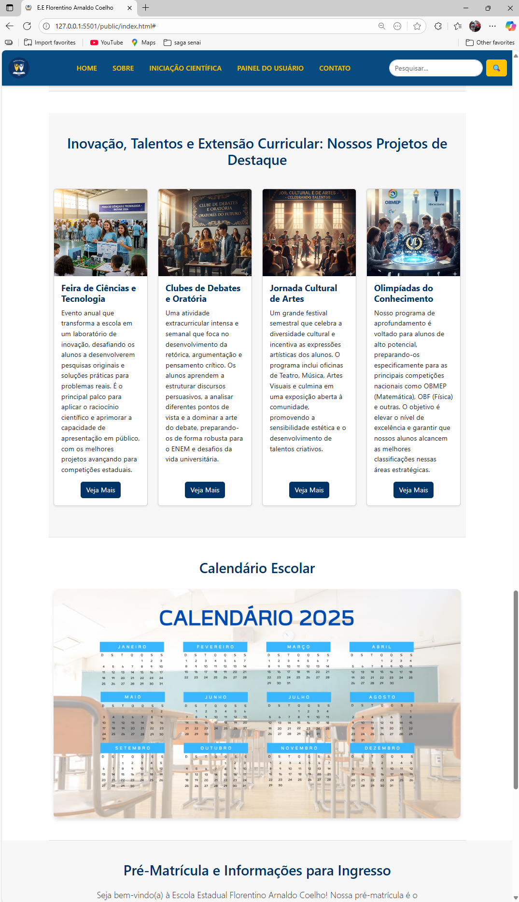
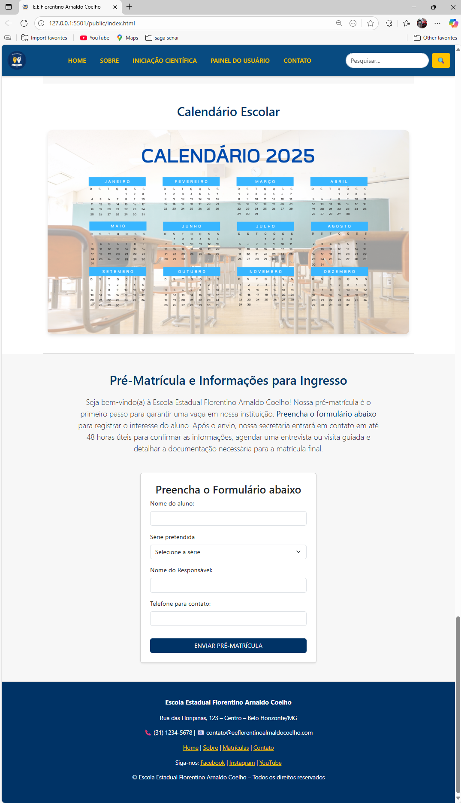
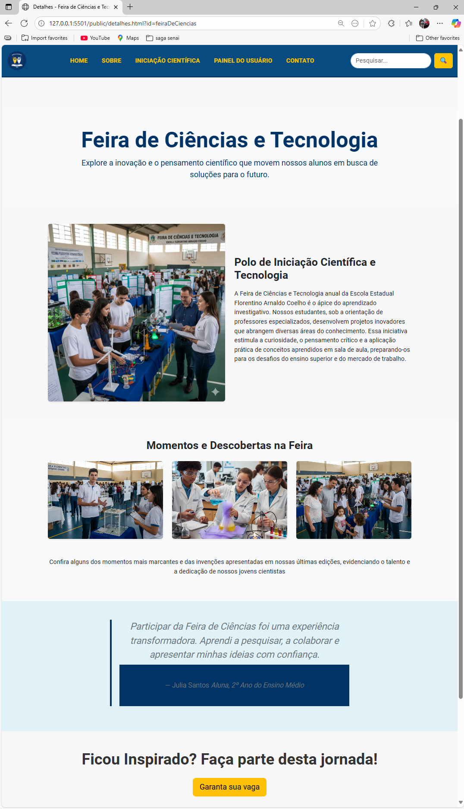
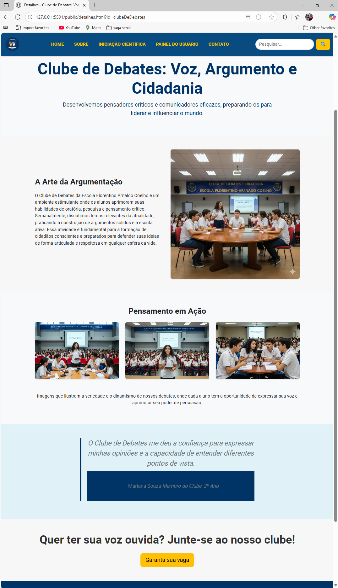
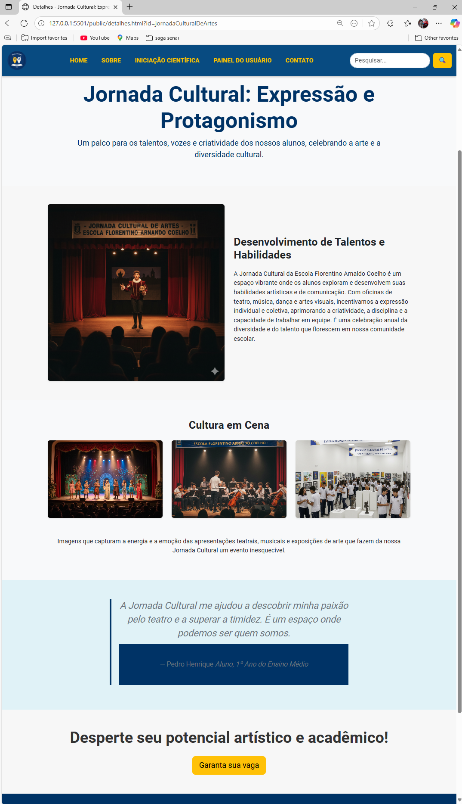
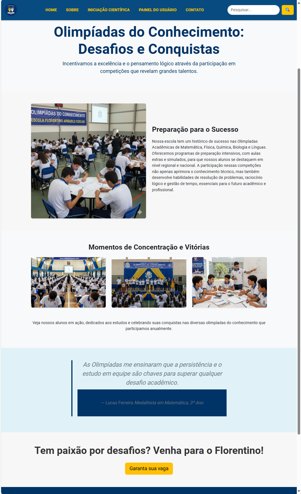

# Trabalho Prático 05 - Semanas 7 e 8

**Páginas de detalhes dinâmicas**

Nessa etapa, vamos evoluir o trabalho anterior, acrescentando a página de detalhes, conforme o  projeto escolhido. Imagine que a página principal (home-page) mostre um visão dos vários itens que existem no seu site. Ao clicar em um item, você é direcionado pra a página de detalhes. A página de detalhe vai mostrar todas as informações sobre o item do seu projeto. seja esse item uma notícia, filme, receita, lugar turístico ou evento.

Leia o enunciado completo no Canvas. 

**IMPORTANTE:** Assim como informado anteriormente, capriche na etapa pois você vai precisar dessa parte para as próximas semanas. 

**IMPORTANTE:** Você deve trabalhar e alterar apenas arquivos dentro da pasta **`public`,** mantendo os arquivos **`index.html`**, **`styles.css`** e **`app.js`** com estes nomes, conforme enunciado. Deixe todos os demais arquivos e pastas desse repositório inalterados. **PRESTE MUITA ATENÇÃO NISSO.**

## Informações Gerais

- Nome: Ítalo Eduardo Carneiro da Silva
- Matricula: 898961
- Proposta de projeto escolhida: (Organização e equipes) - Escolas
- Breve descrição sobre seu projeto: Este projeto é uma Landing Page  moderna e responsiva, desenvolvida para simular o website institucional da Escola Estadual fictícia Florentino Arnaldo Coelho. O principal objetivo é demonstrar a aplicação prática de HTML, CSS, o framework Bootstrap e JS para criar uma experiência de usuário (UX) clara e envolvente. A página destaca os pilares de uma instituição de ensino de excelência: Missão visão e Valores,História da escola, Projetos de Destaque (como Iniciação Científica e Cultura) e um Fluxo de Pré-Matrícula direto. O design foi pensado para transmitir confiança, profissionalismo e dinamismo, utilizando uma paleta de cores azul e um layout limpo para facilitar a navegação e a comunicação com a comunidade escolar.

## Print da Home-Page







## Print da página de detalhes do item






## Cole aqui abaixo a estrutura JSON utilizada no app.js

```javascript
// estrutura json pagina de detalhes
const projetosDetalhes = { // Renomeado para seguir o padrão camelCase

    // Feira de Ciências e Tecnologia
    "feiraDeCiencias": { // ID em camelCase
        // Seção Detalhes principal
        titulo: "Feira de Ciências e Tecnologia", 
        introducao: "Explore a inovação e o pensamento científico que movem nossos alunos em busca de soluções para o futuro.", 

        // Seção de detalhes 1 (imagem + texto)
        secaoDetalhes1: { 
            titulo: "Polo de Iniciação Científica e Tecnologia", 
            imagem: "img/alunos_trabalhando_feira_de_ciencias.png", 
            altImagem: "Alunos trabalhando em projeto de feira de ciências",
            texto: `A Feira de Ciências e Tecnologia anual da Escola Estadual Florentino Arnaldo Coelho é o ápice do aprendizado investigativo. Nossos estudantes, sob a orientação de professores especializados, desenvolvem projetos inovadores que abrangem diversas áreas do conhecimento. Essa iniciativa estimula a curiosidade, o pensamento crítico e a aplicação prática de conceitos aprendidos em sala de aula, preparando-os para os desafios do ensino superior e do mercado de trabalho.`,
            layout: "image-left"
        },

        // Seção de galeria
        galeria: { 
            titulo: "Momentos e Descobertas na Feira", 
            imagens: [ 
                { src: "img/aluno_apresentando_projeto_feira.png", alt: "Aluno apresentando projeto na feira" },
                { src: "img/experimento_cientifico_em_andamento.png", alt: "Experimento científico em andamento" },
                { src: "img/visitantes_interagindo_feira.png", alt: "Visitantes interagindo com projetos na feira" }
            ],
            descricao: "Confira alguns dos momentos mais marcantes e das invenções apresentadas em nossas últimas edições, evidenciando o talento e a dedicação de nossos jovens cientistas"
        },

        // Seção de depoimento
        depoimento: { 
            texto: "Participar da Feira de Ciências foi uma experiência transformadora. Aprendi a pesquisar, a colaborar e apresentar minhas ideias com confiança.", 
            autor: "Julia Santos", 
            posicao: "Aluna, 2º Ano do Ensino Médio" 
        },

        // Seção de botão de pré-matrícula (CTA - Call To Action)
        cta: { 
            titulo: "Ficou Inspirado? Faça parte desta jornada!", 
            textoBotao: "Garanta sua vaga", 
            linkBotao: "index.html#ma" 
        }
    },


    // Clube de Debates e Oratória
    "clubeDeDebates": { 
        titulo: "Clube de Debates: Voz, Argumento e Cidadania",
        introducao: "Desenvolvemos pensadores críticos e comunicadores eficazes, preparando-os para liderar e influenciar o mundo.",

        // Seção de detalhes 1 (imagem + texto)
        secaoDetalhes1: {
            titulo: "A Arte da Argumentação",
            imagem: "img/alunos_participando_de_debate.png", 
            altImagem: "Alunos participando de um debate",
            texto: `O Clube de Debates da Escola Florentino Arnaldo Coelho é um ambiente estimulante onde os alunos aprimoram suas habilidades de oratória, pesquisa e pensamento crítico. Semanalmente, discutimos temas relevantes da atualidade, praticando a construção de argumentos sólidos e a escuta ativa. Essa atividade é fundamental para a formação de cidadãos conscientes e preparados para defender suas ideias de forma articulada e respeitosa em qualquer esfera da vida.`,
            layout: "image-right" 
        },

        // Seção de galeria
        galeria: {
            titulo: "Pensamento em Ação",
            imagens: [
                { src: "img/mesa_de_debate_com_alunos.png", alt: "Mesa de debate estudantil com alunos" },
                { src: "img/aluna_fazendo_apresentacao_oral.png", alt: "Aluna fazendo apresentação oral" },
                { src: "img/grupo_de_debate_em_discussao_ativa.png", alt: "Grupo de debate em discussão ativa" }
            ],
            descricao: "Imagens que ilustram a seriedade e o dinamismo de nossos debates, onde cada aluno tem a oportunidade de expressar sua voz e aprimorar seu poder de persuasão."
        },

        // Seção de depoimento
        depoimento: {
            texto: "O Clube de Debates me deu a confiança para expressar minhas opiniões e a capacidade de entender diferentes pontos de vista.",
            autor: "Mariana Souza",
            posicao: "Membro do Clube, 2º Ano"
        },

        // Seção de botão de pré-matrícula
        cta: {
            titulo: "Quer ter sua voz ouvida? Junte-se ao nosso clube!",
            textoBotao: "Garanta sua vaga",
            linkBotao: "index.html#ma"
        }
    },

    // Jornada Cultural de Artes
    "jornadaCulturalDeArtes": { 
        titulo: "Jornada Cultural: Expressão e Protagonismo",
        introducao: "Um palco para os talentos, vozes e criatividade dos nossos alunos, celebrando a arte e a diversidade cultural.",

        // Seção de detalhes 1 (imagem + texto)
        secaoDetalhes1: {
            titulo: "Desenvolvimento de Talentos e Habilidades",
            imagem: "img/aluno_em_apresentacao_teatral.png", 
            altImagem: "Aluno em apresentação teatral",
            texto: `A Jornada Cultural da Escola Florentino Arnaldo Coelho é um espaço vibrante onde os alunos exploram e desenvolvem suas habilidades artísticas e de comunicação. Com oficinas de teatro, música, dança e artes visuais, incentivamos a expressão individual e coletiva, aprimorando a criatividade, a disciplina e a capacidade de trabalhar em equipe. É uma celebração anual da diversidade e do talento que florescem em nossa comunidade escolar.`,
            layout: "image-left"
        },

        // Seção de galeria
        galeria: {
            titulo: "Cultura em Cena",
            imagens: [
                { src: "img/peca_de_teatro_estudantil.png", alt: "Peça de teatro estudantil" },
                { src: "img/alunos_tocando_instrumentos.png", alt: "Alunos tocando instrumentos musicais" },
                { src: "img/exposicao_de_arte_estudantil.png", alt: "Exposição de arte estudantil" }
            ],
            descricao: "Imagens que capturam a energia e a emoção das apresentações teatrais, musicais e exposições de arte que fazem da nossa Jornada Cultural um evento inesquecível."
        },

        // Seção de depoimento
        depoimento: {
            texto: "A Jornada Cultural me ajudou a descobrir minha paixão pelo teatro e a superar a timidez. É um espaço onde podemos ser quem somos.",
            autor: "Pedro Henrique",
            posicao: "Aluno, 1º Ano do Ensino Médio"
        },
        cta: {
            titulo: "Desperte seu potencial artístico e acadêmico!",
            textoBotao: "Garanta sua vaga",
            linkBotao: "index.html#ma"
        }
    },


    // Seção de Olimpíadas Acadêmicas
    "olimpiadasDoConhecimento": { 
        titulo: "Olimpíadas do Conhecimento: Desafios e Conquistas",
        introducao: "Incentivamos a excelência e o pensamento lógico através da participação em competições que revelam grandes talentos.",

        // Seção de detalhes (imagem + texto)
        secaoDetalhes1: {
            titulo: "Preparação para o Sucesso",
            imagem: "img/alunos_resolvendo_problemas.png", 
            altImagem: "Alunos resolvendo problemas em competição",
            texto: `Nossa escola tem um histórico de sucesso nas Olimpíadas Acadêmicas de Matemática, Física, Química, Biologia e Línguas. Oferecemos programas de preparação intensivos, com aulas extras e simulados, para que nossos alunos se destaquem em nível regional e nacional. A participação nessas competições não apenas aprimora o conhecimento técnico, mas também desenvolve habilidades de resolução de problemas, raciocínio lógico e gestão de tempo, essenciais para o futuro acadêmico e profissional.`,
            layout: "image-left"
        },

        // Seção de Galeria
        galeria: {
            titulo: "Momentos de Concentração e Vitórias",
            imagens: [
                { src: "img/alunos_concentrados_em_provas.png", alt: "Alunos concentrados em prova" },
                { src: "img/cerimonia_de_premiacao_olimpiadas.png", alt: "Cerimônia de premiação de olimpíada" },
                { src: "img/grupo_de_estudo_olimpiadas.png", alt: "Grupo de estudo para olimpíadas" }
            ],
            descricao: "Veja nossos alunos em ação, dedicados aos estudos e celebrando suas conquistas nas diversas olimpíadas do conhecimento que participamos anualmente."
        },

        // Seção de depoimento
        depoimento: {
            texto: "As Olimpíadas me ensinaram que a persistência e o estudo em equipe são chaves para superar qualquer desafio acadêmico.",
            autor: "Lucas Ferreira",
            posicao: "Medalhista em Matemática, 3º Ano"
        },

        // Seção de pré-matrícula das olimpíadas do conhecimento
        cta: {
            titulo: "Tem paixão por desafios? Venha para o Florentino!",
            textoBotao: "Garanta sua vaga",
            linkBotao: "index.html#ma"
        }
    },
};
```